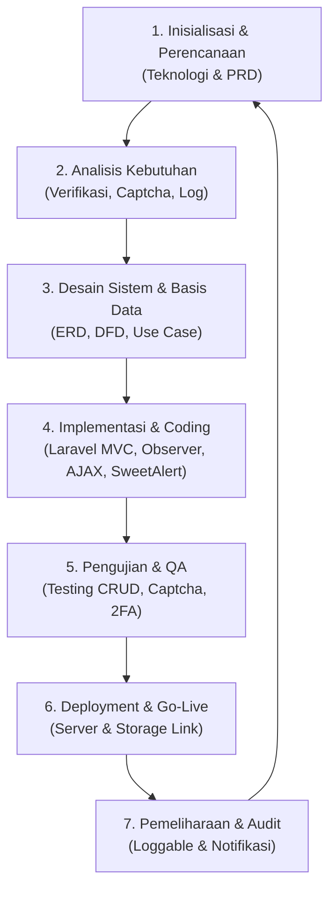
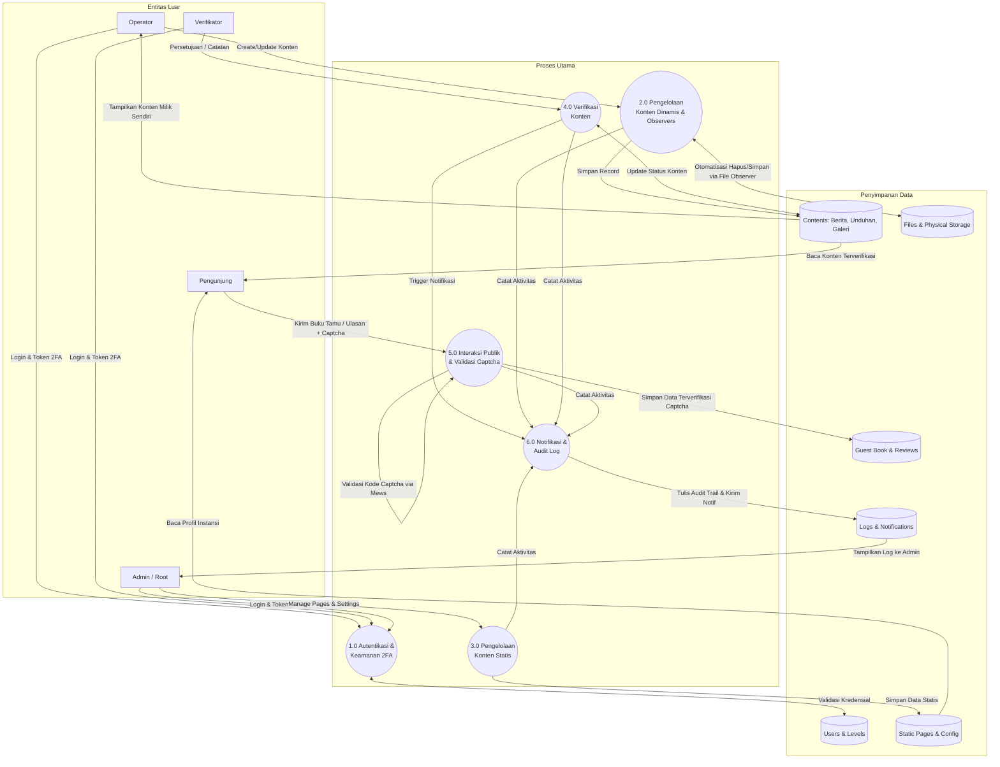
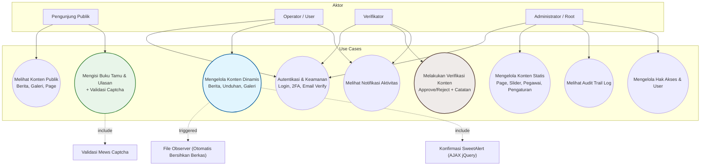

# Product Requirement Document (PRD)
## Proyek Portal Website Diskominfotik

> [!NOTE]
> Dokumen ini mendefinisikan seluruh spesifikasi kebutuhan produk, alur kerja sistem, arsitektur data, dan diagram pendukung untuk pembangunan sistem Portal Website Dinas Komunikasi, Informatika, dan Statistik (Diskominfotik).

---

## 1. Deskripsi Umum Proyek
Portal Website Diskominfotik adalah platform informasi terintegrasi yang berfungsi sebagai gerbang informasi resmi bagi publik dan media internal dinas. Sistem ini dibangun menggunakan framework **Laravel** dengan arsitektur **MVC (Model-View-Controller)**. 

Untuk tampilan antarmuka dan interaksi klien, sistem menggunakan **Bootstrap** dan **jQuery** untuk memproses operasi CRUD asinkron (AJAX), didukung dengan **SweetAlert** untuk dialog umpan balik visual yang interaktif. Dari sisi keamanan publik dan kebersihan data, portal ini memanfaatkan **Mews Captcha** untuk mengamankan formulir publik dan **File Observer** untuk otomatisasi pengelolaan file fisik di server.

---

## 2. Arsitektur & Teknologi Stack
Berikut adalah spesifikasi teknologi yang digunakan dalam proyek ini:

1.  **Framework Backend**: Laravel (PHP) dengan implementasi **MVC (Model-View-Controller)** murni.
2.  **Sistem Autentikasi**: Laravel Fortify + Jetstream (Mendukung Two-Factor Authentication via Google Authenticator).
3.  **Antarmuka Pengguna (UI/UX)**: 
    *   **Bootstrap**: Framework CSS utama untuk tata letak yang responsif.
    *   **SweetAlert**: Penanganan dialog konfirmasi (seperti konfirmasi hapus data) dan alert notifikasi sukses/gagal.
4.  **Skrip Sisi Klien**: **jQuery** untuk manipulasi DOM dan request AJAX yang terintegrasi dengan DataTable.
5.  **Pengelolaan Berkas (File Observer)**: Menggunakan Laravel Observers (seperti `FileObserver`) yang mendeteksi perubahan model (CREATE, UPDATE, DELETE) untuk mengunggah atau menghapus berkas fisik di direktori penyimpanan (`storage`) secara otomatis saat record database dihapus (menghindari tumpukan sampah file di server).
6.  **Proteksi Spam**: **Mews Captcha** untuk memvalidasi input manusia pada halaman buku tamu dan ulasan publik.

---

## 3. Software Life Cycle (SLC)
Metodologi siklus hidup pengembangan sistem yang digunakan adalah **SDLC Agile / Iterative Waterfall**, yang membagi proyek ke dalam fase-fase terstruktur:

### Fase Siklus Hidup Sistem:
1. **Inisialisasi & Perencanaan**: Identifikasi kebutuhan modul utama portal, penentuan teknologi stack (Laravel, Bootstrap, jQuery, SweetAlert, Observers, Captcha), dan penyusunan PRD ini.
2. **Analisis Kebutuhan**: Menganalisis alur verifikasi konten, validasi Captcha, dan audit log sistem.
3. **Desain Sistem & Basis Data**: Perancangan database (ERD), alur data (DFD), Use Case, serta rancangan antarmuka pengguna (UI/UX) berbasis Bootstrap.
4. **Implementasi & Coding**:
    *   Pembuatan struktur MVC menggunakan *MVC Builder*.
    *   Integrasi Fortify & Google Authenticator.
    *   Pembuatan `FileObserver` untuk melacak penghapusan file di database dan fisik disk secara otomatis.
    *   Implementasi validasi Mews Captcha pada form buku tamu & ulasan.
    *   Penyelarasan interaksi AJAX jQuery dengan feedback modal SweetAlert.
5. **Pengujian (Testing)**: Pengujian fungsionalitas CRUD AJAX, integrasi Observers, validasi spam Captcha, dialog SweetAlert, dan uji keamanan 2FA.
6. **Deployment & Go-Live**: Pemasangan sistem pada server produksi (Apache/Nginx) dan aktivasi symlink storage.
7. **Pemeliharaan & Pemantauan**: Pemantauan log aktivitas melalui modul Loggable dan pemantauan notifikasi.



---

## 4. Manajemen Akses & Role Level (RBAC)
Sistem memiliki 4 tingkatan peran (*role levels*) dengan pembatasan hak akses yang dikelola melalui matriks menu grup:

| Fitur / Modul | Root | Administrator | Operator / User | Verifikator | Pengunjung (Public) |
| :--- | :---: | :---: | :---: | :---: | :---: |
| **Manajemen Pengguna & Level** | ✅ | ❌ | ❌ | ❌ | ❌ |
| **Manajemen Grup Akses Menu** | ✅ | ❌ | ❌ | ❌ | ❌ |
| **Pengaturan Sistem Global** | ✅ | ✅ | ❌ | ❌ | ❌ |
| **Konten Statis (Page, Slider, dll)** | ✅ | ✅ | ❌ | ❌ | ❌ |
| **Konten Dinamis (Milik Sendiri)** | ✅ | ✅ | ✅ (Hanya Milik Sendiri) | ✅ | ❌ |
| **Konten Dinamis (Milik User Lain)** | ✅ | ✅ | ❌ | ✅ | ❌ |
| **Verifikasi Konten Dinamis** | ✅ | ✅ | ❌ | ✅ | ❌ |
| **Melihat Audit Log & Notifikasi** | ✅ | ✅ | ✅ (Notifikasi Pribadi) | ✅ | ❌ |
| **Mengisi Ulasan & Buku Tamu** | ❌ | ❌ | ❌ | ❌ | ✅ (Dengan Captcha) |
| **Melihat Konten di Frontend** | ✅ | ✅ | ✅ | ✅ | ✅ (Hanya yang Terverifikasi) |

> [!IMPORTANT]
> **Aturan Kepemilikan Konten Operator**:
> Pengguna dengan level **Operator / User** hanya dapat melihat, menambah, mengubah, dan menghapus konten (Berita, Unduhan, Galeri) yang mereka buat sendiri (`user_id` cocok dengan ID pengguna aktif). Mereka dibatasi secara ketat oleh *Query Scope* sehingga tidak dapat melihat data milik operator lain di panel admin.

---

## 5. Keamanan & Autentikasi (Laravel Fortify & 2FA)
Untuk menjamin keamanan tingkat tinggi pada gerbang admin, sistem menggunakan arsitektur keamanan berikut:
1. **Laravel Fortify**: Menangani logika autentikasi dasar, registrasi, verifikasi email, dan pemulihan kata sandi tanpa dependensi UI.
2. **Two-Factor Authentication (2FA) via Google Authenticator**: Pengguna (terutama Root, Admin, dan Verifikator) wajib mengaktifkan 2FA. Autentikasi dilakukan dengan memindai kode QR dari aplikasi Google Authenticator untuk menghasilkan Time-Based One-Time Password (TOTP) saat login.
3. **Verifikasi Email**: Pengguna baru yang mendaftar wajib melakukan verifikasi email melalui tautan token unik yang dikirimkan ke email mereka sebelum dapat mengakses menu dashboard.
4. **Lupa Password**: Mekanisme pengiriman email berisi tautan reset kata sandi menggunakan token kedaluwarsa cepat (*secure token with expiration*).

---

## 6. Spesifikasi Fungsional Modul

### 6.1 Modul Konten Dinamis (Admin & Operator Menu)
Setiap konten dinamis wajib memiliki relasi ke modul **Kategori** dan mendukung unggahan berkas secara polimorfik yang dimonitor oleh **File Observer**.
*   **Berita**: Artikel informasi kegiatan dinas. Memiliki judul, slug otomatis, isi/deskripsi berita, kategori, jumlah pembaca (*view*), status publikasi, pembuat (*author*), dan verifikator.
*   **Unduhan**: File publikasi, dokumen regulasi, atau formulir. Memiliki pelacak jumlah unduhan (*download count*).
*   **Galeri**: Dokumentasi foto/kegiatan dinas beserta keterangan singkat.
> [!NOTE]
> **Otomatisasi File Observer**: Ketika konten Berita, Unduhan, atau Galeri dihapus melalui panel admin (oleh Operator/Admin), **File Observer** menangkap *event* `deleted` dari model, lalu secara otomatis memicu metode penghapusan file fisik dari storage server (`Storage::delete($path)`), sehingga mencegah file yatim piatu (*orphan files*).

### 6.2 Modul Konten Statis (Admin Menu)
Hanya dapat dikelola oleh level **Administrator** dan **Root**:
*   **Page**: Halaman statis khusus untuk profil instansi, visi misi, sejarah, dll.
*   **Slider**: Gambar latar depan dinamis (banner slide) pada halaman beranda frontend.
*   **Tautan**: Daftar tautan penting/cepat menuju website eksternal atau mitra instansi.
*   **Penghargaan**: Daftar prestasi atau sertifikasi yang diraih instansi.
*   **Kategori**: Manajemen kategori konten dinamis secara hierarki (*parent-child structure*).
*   **Pegawai (Struktur)**: Informasi pejabat dan pegawai dinas (nama, jabatan, deskripsi tugas, foto).
*   **Pengaturan**: Konfigurasi umum seperti nama portal, logo instansi, alamat kontak, media sosial, dan status maintenance.

### 6.3 Modul Konten Interaktif (User/Public Frontend)
Mewajibkan validasi Captcha untuk mencegah serangan bot/spam.
*   **Buku Tamu**: Publik mengisi data kunjungan (nama, alamat, instansi, no HP, email, keperluan, pesan, jenis kelamin, dan **kode Captcha**). Data masuk ke admin untuk diverifikasi/disetujui.
*   **Ulasan (Testimoni)**: Masukan publik mengenai pelayanan dinas disertai dengan **validasi Captcha**. Hanya ulasan berstatus terverifikasi yang tayang di halaman depan.

### 6.4 Modul Verifikasi (Verifikator Menu)
Menyediakan alur persetujuan konten dinamis sebelum ditampilkan ke publik:
*   Konten baru berstatus **Draft/Submitted** secara default.
*   Verifikator melakukan peninjauan konten, memberikan catatan perbaikan jika perlu, lalu mengubah status menjadi **Terverifikasi** (Disetujui) atau **Ditolak**.
*   **Aturan Tampilan Frontend**: Hanya konten dengan status **Terverifikasi** yang akan di-render di halaman depan (frontend).

### 6.5 Modul Notifikasi
Sistem notifikasi dinamis untuk mencatat proses penting:
*   Setiap kali operator membuat konten, sistem mengirim notifikasi ke Verifikator.
*   Setiap kali verifikator menyetujui/menolak konten, notifikasi dikirim kembali ke Operator pembuat konten.
*   Pemberitahuan ditampilkan di bilah navigasi admin (*sidebar/header notification*).

### 6.6 Modul Loggable (System Audit Trail)
Modul pelacak audit otomatis untuk setiap perubahan data di database (CREATE, UPDATE, DELETE) menggunakan trait `Loggable`:
*   Menangkap data sebelum (*before*) dan sesudah (*after*) perubahan.
*   Mencatat aktor pengubah (`user_id`), IP Address, User Agent (Browser/OS), URL permintaan, serta metode HTTP.
*   Data perubahan disimpan dalam bentuk JSON terstruktur untuk kemudahan audit internal.

---

## 7. Diagram Alir Data (DFD)

### 7.1 DFD Level 0 (Context Diagram)
Context diagram menggambarkan aliran data antara entitas luar (Pengunjung, Operator, Verifikator, Administrator/Root) dengan sistem Portal Diskominfotik.

```mermaid
graph TD
    Public["Pengunjung (Publik)"]
    Opr["Operator / User"]
    Ver["Verifikator"]
    Adm["Administrator / Root"]
    System(("Portal Diskominfotik<br/>(System)")]

    %% Aliran Pengunjung
    Public -->|1. Isi Buku Tamu & Ulasan + Captcha| System
    System -->|2. Tampilkan Berita Terverifikasi, Galeri, Unduhan & Page| Public

    %% Aliran Operator
    Opr -->|3. Input Konten Dinamis Berita/Unduhan/Galeri| System
    System -->|4. Kirim Status Verifikasi & Notifikasi| Opr

    %% Aliran Verifikator
    Ver -->|5. Input Status Verifikasi & Catatan| System
    System -->|6. Data Konten Pending Verifikasi| Ver

    %% Aliran Admin/Root
    Adm -->|7. Kelola Pengguna, Hak Akses, Konten Statis| System
    System -->|8. Tampilkan Laporan Audit Log & Statistik| Adm
```

### 7.2 DFD Level 1
DFD Level 1 membagi sistem menjadi 6 proses utama dengan penambahan proses validasi Captcha dan pengelolaan File Observer.



---

## 8. Use Case Diagram
Diagram use case memetakan peran masing-masing aktor terhadap fitur-fitur fungsional sistem.



---

## 9. Entity Relationship Diagram (ERD)
Arsitektur database dirancang menggunakan hubungan tabel relasional dengan memanfaatkan UUID sebagai Primary Key pada sebagian besar entitas utama dan relasi polimorfik untuk penanganan file, verifikasi, log, dan notifikasi.

```mermaid
erDiagram
    LEVELS {
        bigint id PK
        string name
        string code
        json access
        timestamps created_at
    }

    ACCESS_GROUPS {
        uuid id PK
        string name
        json access
        timestamps created_at
    }

    USERS {
        uuid id PK
        string first_name
        string last_name
        string email
        string password
        timestamp email_verified_at
        bigint level_id FK
        uuid access_group_id FK
        string remember_token
        timestamps created_at
    }

    KATEGORIS {
        uuid id PK
        string nama
        string slug
        text desc
        string ikon
        string status
        uuid user_id FK
        uuid parent_id FK
        timestamps created_at
    }

    BERITAS {
        uuid id PK
        string nama
        string slug
        text desc
        string kategori
        string keterangan
        bigint view
        string status
        uuid user_id FK
        uuid verifikator_id FK
        timestamps created_at
    }

    UNDUHAS {
        uuid id PK
        string nama
        string slug
        text desc
        string kategori
        string status
        bigint download
        bigint view
        uuid user_id FK
        uuid verifikator_id FK
        timestamps created_at
    }

    GALERIS {
        uuid id PK
        string nama
        string slug
        text desc
        string kategori
        string keterangan
        string status
        uuid user_id FK
        timestamps created_at
    }

    VERIFIKASIS {
        uuid id PK
        string verifiable_type
        uuid verifiable_id
        text catatan
        string status
        uuid user_id FK
        timestamps created_at
    }

    TAMUS {
        uuid id PK
        string nama
        text alamat
        string no_hp
        string email
        string jenis_kelamin
        string pekerjaan
        string asal
        string keperluan
        text pesan
        string status
        dateTime tanggal_kunjungan
        string ip_address
        uuid user_id FK
        uuid verifikator_id FK
        timestamps created_at
    }

    TESTIMONIS {
        uuid id PK
        string nama
        text desc
        string keterangan
        string status
        uuid user_id FK
        timestamps created_at
    }

    PAGES {
        uuid id PK
        string nama
        string slug
        text desc
        string status
        uuid user_id FK
        timestamps created_at
    }

    SLIDERS {
        uuid id PK
        string nama
        string status
        uuid user_id FK
        timestamps created_at
    }

    TAUTANS {
        uuid id PK
        string nama
        string url
        string status
        uuid user_id FK
        timestamps created_at
    }

    PENGHARGAANS {
        uuid id PK
        string nama
        text desc
        string status
        uuid user_id FK
        timestamps created_at
    }

    STRUKTURS {
        uuid id PK
        string nama
        string jabatan
        string tugas
        string status
        uuid user_id FK
        timestamps created_at
    }

    PENGATURANS {
        uuid id PK
        string code
        string name
        text value
        string type
        timestamps created_at
    }

    FILES {
        uuid id PK
        string fileable_type
        uuid fileable_id
        string name
        string path
        string mime
        string size
        string alias
        timestamps created_at
    }

    NOTIFICATIONS {
        uuid id PK
        string notifiable_type
        uuid notifiable_id
        boolean status
        json data
        uuid user_id FK
        timestamps created_at
    }

    LOGS {
        uuid id PK
        string loggable_type
        uuid loggable_id
        ipAddress ip
        text user_agent
        json data
        timestamps created_at
    }

    %% Relasi Tabel
    LEVELS ||--o{ USERS : "assigns to"
    ACCESS_GROUPS ||--o{ USERS : "assigns to"
    USERS ||--o{ KATEGORIS : "creates"
    KATEGORIS ||--o{ KATEGORIS : "has subcategory"
    
    USERS ||--o{ BERITAS : "writes"
    USERS ||--o{ UNDUHAS : "uploads"
    USERS ||--o{ GALERIS : "creates"
    
    USERS ||--o{ PAGES : "manages"
    USERS ||--o{ SLIDERS : "manages"
    USERS ||--o{ TAUTANS : "manages"
    USERS ||--o{ PENGHARGAANS : "manages"
    USERS ||--o{ STRUKTURS : "manages"

    %% Relasi Verifikator
    USERS ||--o{ BERITAS : "verifies (verifikator_id)"
    USERS ||--o{ UNDUHAS : "verifies (verifikator_id)"
    USERS ||--o{ TAMUS : "approves (verifikator_id)"

    %% Relasi Interaksi Publik
    USERS ||--o{ TAMUS : "handles (user_id)"
    USERS ||--o{ TESTIMONIS : "manages (user_id)"

    %% Relasi Polimorfik (M:N / MorphMany) - Dimonitor oleh File Observer
    BERITAS ||--o{ FILES : "has many images/attachments (Observed)"
    UNDUHAS ||--o{ FILES : "has download file (Observed)"
    GALERIS ||--o{ FILES : "has gallery images (Observed)"
    
    BERITAS ||--o{ VERIFIKASIS : "can be verified"
    UNDUHAS ||--o{ VERIFIKASIS : "can be verified"
    GALERIS ||--o{ VERIFIKASIS : "can be verified"
    
    BERITAS ||--o{ NOTIFICATIONS : "triggers notifications"
    UNDUHAS ||--o{ NOTIFICATIONS : "triggers notifications"
    
    USERS ||--o{ LOGS : "logs actions (loggable)"
    BERITAS ||--o{ LOGS : "logs changes"
    UNDUHAS ||--o{ LOGS : "logs changes"
    GALERIS ||--o{ LOGS : "logs changes"
    TAMUS ||--o{ LOGS : "logs changes"
```



---

> [!TIP]
> **Rekomendasi Implementasi**:
> Manfaatkan *Eloquent Sluggable* pada model `Berita`, `Unduhan`, `Galeri`, dan `Page` agar URL lebih ramah SEO. Gunakan *Laravel Fortify 2FA* yang dipadukan dengan *Livewire* atau *jQuery* untuk verifikasi token Google Authenticator pada panel login admin. Gunakan SweetAlert pada trigger tombol hapus dengan skrip konfirmasi AJAX jQuery.
