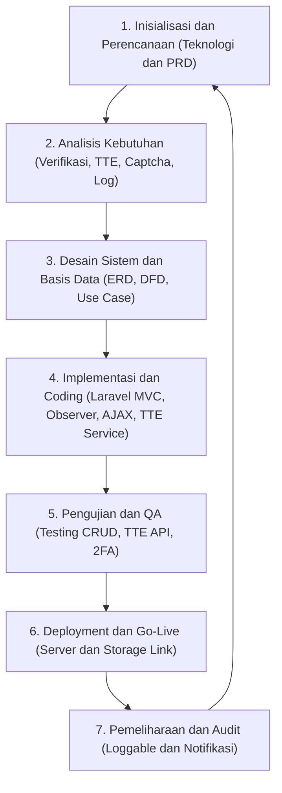
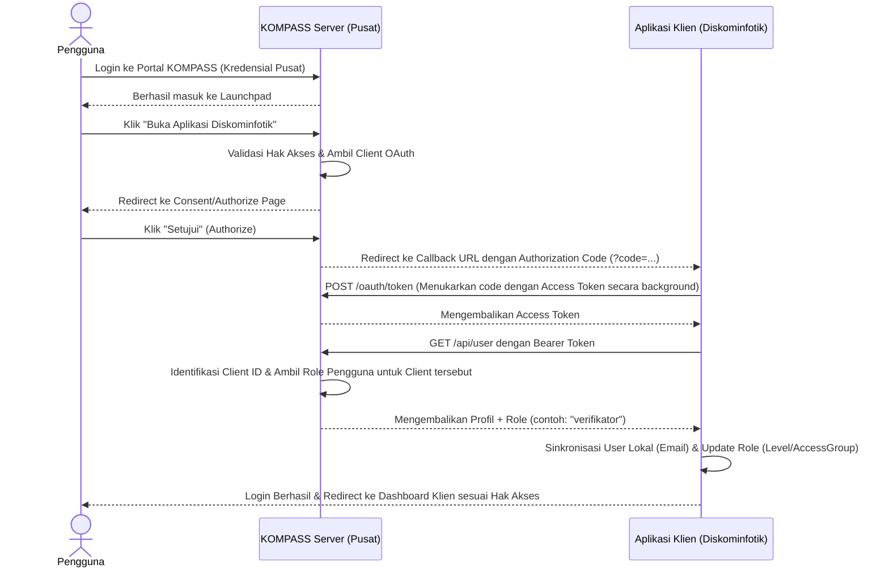
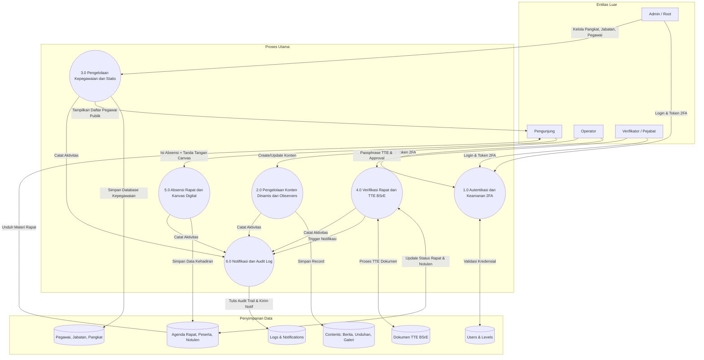
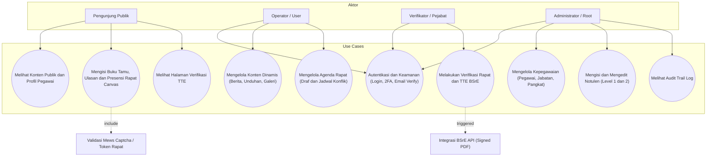

# Product Requirement Document (PRD)
## Proyek Portal Website & Sistem Informasi Agenda Rapat Diskominfotik

> [!NOTE]
> Dokumen ini mendefinisikan seluruh spesifikasi kebutuhan produk, alur kerja sistem, arsitektur data, dan diagram pendukung untuk pembangunan sistem Portal Website Dinas Komunikasi, Informatika, dan Statistik (Diskominfotik), termasuk modul Kepegawaian dan Agenda Rapat Elektronik dengan integrasi TTE (Tanda Tangan Elektronik) BSrE.

---

## 1. Deskripsi Umum Proyek
Portal Website Diskominfotik adalah platform informasi terintegrasi yang berfungsi sebagai gerbang informasi resmi bagi publik dan media internal dinas. Sistem ini dibangun menggunakan framework **Laravel** dengan arsitektur **MVC (Model-View-Controller)**. 

Untuk tampilan antarmuka dan interaksi klien, sistem menggunakan **Bootstrap** dan **jQuery** untuk memproses operasi CRUD asinkron (AJAX), didukung dengan **SweetAlert** untuk dialog umpan balik visual yang interaktif. Dari sisi keamanan publik dan kebersihan data, portal ini memanfaatkan **Mews Captcha** untuk mengamankan formulir publik dan **File Observer** untuk otomatisasi pengelolaan file fisik di server.

Sistem juga dilengkapi dengan modul internal administrasi kedinasan:
1. **Modul Kepegawaian**: Mengelola database kepegawaian (Pangkat, Status Pegawai, Jabatan, Bidang, Profil Pegawai) dan menampilkannya di halaman frontend portal.
2. **Modul Agenda Rapat & TTE**: Mengotomatisasi siklus rapat dari draf agenda, undangan, presensi/daftar hadir online berbasis tanda tangan digital (kanvas HTML5), pengunggahan materi & dokumentasi rapat, pengisian notulen rapat, hingga verifikasi berjenjang menggunakan tanda tangan elektronik (TTE) bersertifikasi BSrE (Badan Siber dan Sandi Negara).

---

## 2. Arsitektur & Teknologi Stack
Berikut adalah spesifikasi teknologi yang digunakan dalam proyek ini:

1.  **Framework Backend**: Laravel (PHP) dengan implementasi **MVC (Model-View-Controller)** murni.
2.  **Sistem Autentikasi**: Laravel Fortify + Jetstream (Mendukung Two-Factor Authentication via Google Authenticator) serta integrasi **KOMPASS SSO** (OAuth2 Client via HTTP integration).
3.  **Antarmuka Pengguna (UI/UX)**: 
    *   **Bootstrap**: Framework CSS utama untuk tata letak yang responsif.
    *   **SweetAlert**: Penanganan dialog konfirmasi (seperti konfirmasi hapus data) dan alert notifikasi sukses/gagal.
4.  **Skrip Sisi Klien**: **jQuery** untuk manipulasi DOM dan request AJAX yang terintegrasi dengan DataTable.
5.  **Pengelolaan Berkas (File Observer)**: Menggunakan Laravel Observers (seperti `FileObserver`) yang mendeteksi perubahan model (CREATE, UPDATE, DELETE) untuk mengunggah atau menghapus berkas fisik di direktori penyimpanan (`storage`) secara otomatis saat record database dihapus (menghindari tumpukan sampah file di server).
6.  **Proteksi Spam**: **Mews Captcha** untuk memvalidasi input manusia pada halaman buku tamu dan ulasan publik.
7.  **Tanda Tangan Elektronik**: **BSrE Sign Service** (API BSSN) untuk penandatanganan berkas PDF undangan, daftar hadir, dan notulen rapat secara sah.
8.  **PDF Engine**: **DomPDF** (`barryvdh/laravel-dompdf`) untuk mengekspor dokumen undangan, daftar hadir, dan notulen rapat.

---

## 3. Software Life Cycle (SLC)
Metodologi siklus hidup pengembangan sistem yang digunakan adalah **SDLC Agile / Iterative Waterfall**, yang membagi proyek ke dalam fase-fase terstruktur:

### Fase Siklus Hidup Sistem:
1. **Inisialisasi & Perencanaan**: Identifikasi kebutuhan modul utama portal, penentuan teknologi stack (Laravel, Bootstrap, jQuery, SweetAlert, Observers, Captcha), dan penyusunan PRD ini.
2. **Analisis Kebutuhan**: Menganalisis alur verifikasi konten, validasi Captcha, audit log sistem, alur kepegawaian, serta alur penandatanganan dokumen rapat secara elektronik (TTE).
3. **Desain Sistem & Basis Data**: Perancangan database (ERD), alur data (DFD), Use Case, serta rancangan antarmuka pengguna (UI/UX) berbasis Bootstrap.
4. **Implementasi & Coding**:
    *   Pembuatan struktur MVC menggunakan *MVC Builder*.
    *   Integrasi Fortify & Google Authenticator serta integrasi SSO KOMPASS Client.
    *   Pembuatan `FileObserver` untuk melacak penghapusan file di database dan fisik disk secara otomatis.
    *   Implementasi modul Kepegawaian (Pangkat, Status Pegawai, Jabatan, Pegawai) dan visualisasi profil pegawai di frontend.
    *   Implementasi modul Agenda Rapat dengan presensi kanvas HTML5, notulen bertingkat, dan integrasi BSrE API Service.
5. **Pengujian (Testing)**: Pengujian fungsionalitas CRUD AJAX, integrasi Observers, validasi spam Captcha, dialog SweetAlert, uji keamanan 2FA, pengujian penandatanganan PDF via BSrE API, presensi kanvas digital, serta pengujian integrasi alur login SSO KOMPASS.
6. **Deployment & Go-Live**: Pemasangan sistem pada server produksi (Apache/Nginx) dan aktivasi symlink storage.
7. **Pemeliharaan & Pemantauan**: Pemantauan log aktivitas melalui modul Loggable dan pemantauan notifikasi.



---

## 4. Manajemen Akses & Role Level (RBAC)
Sistem memiliki 4 tingkatan peran (*role levels*) dengan pembatasan hak akses yang dikelola melalui matriks menu grup:

| Fitur / Modul | Root (Level 1) | Administrator (Level 2) | Operator / User (Level 3) | Verifikator (Level 4) | Pengunjung (Public) |
| :--- | :---: | :---: | :---: | :---: | :---: |
| **Manajemen Pengguna & Level** | ✅ | ❌ | ❌ | ❌ | ❌ |
| **Manajemen Grup Akses Menu** | ✅ | ❌ | ❌ | ❌ | ❌ |
| **Pengaturan Sistem Global** | ✅ | ✅ | ❌ | ❌ | ❌ |
| **Konten Statis (Page, Slider, dll)** | ✅ | ✅ | ❌ | ❌ | ❌ |
| **Konten Dinamis (Milik Sendiri)** | ✅ | ✅ | ✅ (Hanya Milik Sendiri) | ✅ | ❌ |
| **Konten Dinamis (Milik User Lain)** | ✅ | ✅ | ❌ | ✅ | ❌ |
| **Verifikasi Konten Dinamis** | ✅ | ✅ | ❌ | ✅ | ❌ |
| **Melihat Audit Log & Notifikasi** | ✅ | ✅ | ✅ (Notifikasi Pribadi) | ✅ | ❌ |
| **Mengisi Ulasan & Buku Tamu** | ❌ | ❌ | ❌ | ❌ | ✅ (Dengan Captcha) |
| **Mengelola Kepegawaian** | ✅ | ✅ | ❌ | ❌ | ❌ |
| **Mengelola Agenda Rapat (Draf)** | ✅ | ✅ | ✅ | ❌ | ❌ |
| **Mengisi & Mengedit Notulen** | ✅ | ✅ | ❌ (Dibatasi Level 1-2) | ❌ | ❌ |
| **Verifikasi Rapat & TTE** | ✅ | ❌ | ❌ | ✅ | ❌ |
| **Mengisi Absensi Rapat Online** | ❌ | ❌ | ❌ | ❌ | ✅ (Form Absensi Canvas) |
| **Melihat Konten & Pegawai di Frontend**| ✅ | ✅ | ✅ | ✅ | ✅ (Terverifikasi/Aktif) |

> [!IMPORTANT]
> **Aturan Kepemilikan Konten Operator**:
> Pengguna dengan level **Operator / User** hanya dapat melihat, menambah, mengubah, dan menghapus konten (Berita, Unduhan, Galeri, Agenda Rapat) yang mereka buat sendiri (`user_id` cocok dengan ID pengguna aktif).
> **Restriksi Akses Notulen**: Pengisian, penyimpanan, dan perubahan data Notulen dibatasi secara ketat hanya untuk pengguna Level 1 (Root) dan Level 2 (Administrator) demi menjaga validitas data keputusan rapat.

---

## 5. Keamanan, Autentikasi, & KOMPASS SSO
Untuk menjamin keamanan tingkat tinggi pada gerbang admin, sistem menggunakan arsitektur keamanan berikut:
1. **Laravel Fortify**: Menangani logika autentikasi dasar, registrasi, verifikasi email, dan pemulihan kata sandi tanpa dependensi UI.
2. **Two-Factor Authentication (2FA) via Google Authenticator**: Pengguna (terutama Root, Admin, dan Verifikator) wajib mengaktifkan 2FA. Autentikasi dilakukan dengan memindai kode QR dari aplikasi Google Authenticator untuk menghasilkan Time-Based One-Time Password (TOTP) saat login.
3. **Verifikasi Email**: Pengguna baru yang mendaftar wajib melakukan verifikasi email melalui tautan token unik yang dikirimkan ke email mereka sebelum dapat mengakses menu dashboard.
4. **Lupa Password**: Mekanisme pengiriman email berisi tautan reset kata sandi menggunakan token kedaluwarsa cepat (*secure token with expiration*).
5. **KOMPASS SSO Integration**: Sistem ini terintegrasi sebagai klien ke portal Single Sign-On (SSO) KOMPASS Pusat menggunakan protokol OAuth2 Authorization Code Grant.

---

### 5.1 Alur Autentikasi SSO KOMPASS
Berikut adalah diagram urutan alur login SSO dari server ke klien:



### 5.2 Pemetaan Hak Akses SSO
Data peran pengguna dari server KOMPASS dipetakan secara dinamis ke tingkat akses lokal `Level` dan `AccessGroup` pada database portal Diskominfotik:
* `'admin'` -> Dipetakan ke Level & Access Group: **Administrator (Level 2)**
* `'verifikator'` -> Dipetakan ke Level & Access Group: **Verifikator (Level 4)**
* `'user'` -> Dipetakan ke Level & Access Group: **Operator / User (Level 3)**

---

## 6. Spesifikasi Fungsional Modul

### 6.1 Modul Konten Dinamis (Admin & Operator Menu)
Setiap konten dinamis wajib memiliki relasi ke modul **Kategori** dan mendukung unggahan berkas secara polimorfik yang dimonitor oleh **File Observer**.
*   **Berita**: Artikel informasi kegiatan dinas. Memiliki judul, slug otomatis, isi/deskripsi berita, kategori, jumlah pembaca (*view*), status publikasi, pembuat (*author*), dan verifikator.
*   **Unduhan**: File publikasi, dokumen regulasi, atau formulir. Memiliki pelacak jumlah unduhan (*download count*).
*   **Galeri**: Dokumentasi foto/kegiatan dinas beserta keterangan singkat.
> [!NOTE]
> **Otomatisasi File Observer**: Ketika konten Berita, Unduhan, atau Galeri dihapus melalui panel admin (oleh Operator/Admin), **File Observer** menangkap *event* `deleted` dari model, lalu secara otomatis memicu metode penghapusan file fisik dari storage server (`Storage::delete($path)`), sehingga mencegah file yatim piatu (*orphan files*).

### 6.2 Modul Konten Statis (Admin Menu)
Hanya dapat dikelola oleh level **Administrator** dan **Root**:
*   **Page**: Halaman statis khusus untuk profil instansi, visi misi, sejarah, dll.
*   **Slider**: Gambar latar depan dinamis (banner slide) pada halaman beranda frontend.
*   **Tautan**: Daftar tautan penting/cepat menuju website eksternal atau mitra instansi.
*   **Penghargaan**: Daftar prestasi atau sertifikasi yang diraih instansi.
*   **Kategori**: Manajemen kategori konten dinamis secara hierarki (*parent-child structure*).
*   **Pegawai (Kepegawaian)**: Manajemen data kepegawaian yang komprehensif:
    *   **Jabatan**: Pengelolaan jabatan hierarkis (Pejabat Struktural, Pejabat Fungsional, Staf Pelaksana, PPPK).
    *   **Pangkat**: Pengelolaan pangkat dan golongan PNS (seperti Penata Tk. I / IV b).
    *   **Status Pegawai**: Kategori kepegawaian (PNS, PPPK, Tenaga Kontrak).
    *   **Pegawai**: Profil lengkap pegawai mencakup NIP, NIK, nama lengkap beserta gelar, jenis kelamin, bidang kerja (berelasi ke `pages`), foto profil, serta detail pangkat/jabatan/status.
    *   **Frontend Pegawai**: Menyediakan halaman khusus publik yang menampilkan daftar pegawai terstruktur lengkap dengan avatar default pintar (laki-laki/perempuan) jika foto profil belum diunggah.

### 6.3 Modul Konten Interaktif (User/Public Frontend)
Mewajibkan validasi Captcha untuk mencegah serangan bot/spam.
*   **Buku Tamu**: Publik mengisi data kunjungan (nama, alamat, instansi, no HP, email, keperluan, pesan, jenis kelamin, dan **kode Captcha**). Data masuk ke admin untuk diverifikasi/disetujui.
*   **Ulasan (Testimoni)**: Masukan publik mengenai pelayanan dinas disertai dengan **validasi Captcha**. Hanya ulasan berstatus terverifikasi yang tayang di halaman depan.

### 6.4 Modul Verifikasi Konten Portal (Verifikator Menu)
Menyediakan alur persetujuan konten dinamis sebelum ditampilkan ke publik:
*   Konten baru berstatus **Draft/Submitted** secara default.
*   Verifikator melakukan peninjauan konten, memberikan catatan perbaikan jika perlu, lalu mengubah status menjadi **Terverifikasi** (Disetujui) atau **Ditolak**.
*   **Aturan Tampilan Frontend**: Hanya konten dengan status **Terverifikasi** yang akan di-render di halaman depan (frontend).

### 6.5 Modul Notifikasi
Sistem notifikasi dinamis untuk mencatat proses penting:
*   Setiap kali operator membuat konten atau mengajukan rapat, sistem mengirim notifikasi ke Verifikator.
*   Setiap kali verifikator menyetujui/menolak konten atau rapat, notifikasi dikirim kembali ke Operator pembuat konten.
*   Pemberitahuan ditampilkan di bilah navigasi admin (*sidebar/header notification*).

### 6.6 Modul Loggable (System Audit Trail)
Modul pelacak audit otomatis untuk setiap perubahan data di database (CREATE, UPDATE, DELETE) menggunakan trait `Loggable`:
*   Menangkap data sebelum (*before*) dan sesudah (*after*) perubahan.
*   Mencatat aktor pengubah (`user_id`), IP Address, User Agent (Browser/OS), URL permintaan, serta metode HTTP.
*   Data perubahan disimpan dalam bentuk JSON terstruktur untuk kemudahan audit internal.

### 6.7 Modul Agenda Rapat & TTE BSrE (Siklus Rapat Terpadu)
Modul untuk mengotomatisasi siklus rapat kedinasan yang efisien dan sah secara hukum:
1. **Draf Rapat & Deteksi Konflik**: Operator/Admin mengisi detail rapat. Sistem secara asinkron (AJAX) memvalidasi jadwal sebelum disimpan guna mencegah tumpang tindih waktu pada tempat/ruangan yang sama.
2. **Tab Detail Rapat**: Detail agenda rapat di backend disusun secara teratur menggunakan tab navigasi berurutan: **Undangan**, **Daftar Hadir**, **Materi**, **Dokumentasi**, **Notulen**, dan **Riwayat**.
3. **Absensi Online & Kanvas Tanda Tangan**: Peserta melakukan presensi secara mandiri dengan mengakses token absensi `/rapat/absensi/{token}` (via QR Code di lembar undangan). Halaman presensi didesain premium (glassmorphism + particles.js) dan mewajibkan tanda tangan pada kanvas HTML5 digital. Setelah sukses presensi, peserta mendapatkan akses langsung ke unduhan file materi rapat.
4. **Notulen & Alur Persetujuan**: 
    *   Notulis mengisi notulen dan menyimpan sebagai `DRAFT`.
    *   Notulis mengirim notulen untuk ditandatangani (`MENUNGGU_PERSETUJUAN`).
    *   Pimpinan Rapat memeriksa dan dapat menyetujui (`DISETUJUI`) atau mengembalikan untuk diperbaiki (`REVISI` dengan catatan).
5. **Alur TTE (BSrE API) & PDF Unduhan**:
    *   Sistem mendukung penandatanganan dokumen secara manual (tanda tangan basah) maupun elektronik (TTE via BSrE API BSSN).
    *   Untuk dokumen berstatus TTE Elektronik (Undangan, Daftar Hadir, dan Notulen Rapat), setelah ditandatangani oleh pejabat penanda tangan menggunakan NIP dan *passphrase*, tombol untuk mengunduh dokumen versi manual/un-signed disembunyikan. Admin hanya dapat mengunduh berkas bertanda tangan resmi (signed PDF) yang memuat QR barcode penanda sertifikat elektronik BSrE.
    *   Penandatanganan notulen berjalan secara **sekuensial**: Notulis menandatangani terlebih dahulu (`notulen_notulis`), kemudian diikuti oleh Pimpinan Rapat (`notulen_pimpinan`).
6. **Ekspor Dokumen PDF**:
    *   **PDF Undangan**: Memuat kop dinas resmi, detail rapat, QR Code absensi, dan area TTE/manual.
    *   **PDF Daftar Hadir**: Menampilkan tabel nama peserta beserta gambar tanda tangan kanvas, serta mengganti label "Total Kehadiran" dengan "Jumlah Peserta". Terdapat pula kolom penanda tangan pimpinan rapat (TTE/manual).
    *   **PDF Notulen**: Menyediakan halaman khusus lampiran dokumentasi foto rapat (layout 2 kolom) dan mencantumkan daftar tautan unduhan bahan rapat yang valid untuk kemudahan akses dokumen fisik.
7. **Halaman Verifikasi Publik (`/rapat/verifikasi`)**:
    *   Apabila QR Code pada PDF bertanda tangan elektronik dipindai, pengguna akan diarahkan ke halaman verifikasi publik frontend.
    *   Halaman ini memvalidasi metadata dokumen secara langsung ke basis data (mencocokkan tanda tangan digital, nama penanda tangan, jabatan, NIP, status BSrE, dan waktu penandatanganan) untuk menyatakan keabsahan berkas.

---

## 7. Diagram Alir Data (DFD)

### 7.1 DFD Level 0 (Context Diagram)
Context diagram menggambarkan aliran data antara entitas luar (Pengunjung, Operator, Verifikator/Pejabat, Administrator/Root) dengan sistem Portal Diskominfotik.

```mermaid
graph TD
    Public["Pengunjung (Publik)"]
    Opr["Operator / User"]
    Ver["Verifikator / Pejabat"]
    Adm["Administrator / Root"]
    System("Sistem Portal dan Rapat Diskominfotik")

    %% Aliran Pengunjung
    Public -->|1. Buku Tamu, Ulasan + Captcha, Absensi Canvas| System
    System -->|2. Tampilkan Konten, Halaman Pegawai, Halaman Verifikasi TTE| Public

    %% Aliran Operator
    Opr -->|3. Input Konten Dinamis, Draf Agenda, Notulen (Draft)| System
    System -->|4. Kirim Status Verifikasi & Notifikasi Rapat| Opr

    %% Aliran Verifikator
    Ver -->|5. Verifikasi Rapat, Input Passphrase TTE BSrE, Approval Notulen| System
    System -->|6. Data Konten & Dokumen Rapat Pending Sign| Ver

    %% Aliran Admin/Root
    Adm -->|7. Kelola Pengguna, Kepegawaian, Akses Menu, Notulen (Override)| System
    System -->|8. Tampilkan Laporan Audit Log & Statistik| Adm
```

### 7.2 DFD Level 1
DFD Level 1 membagi sistem menjadi proses-proses utama dengan penambahan sistem Kepegawaian, Rapat, dan TTE.



---

## 8. Use Case Diagram
Diagram use case memetakan peran masing-masing aktor terhadap fitur-fitur fungsional sistem.



---

## 9. Entity Relationship Diagram (ERD)
Arsitektur database dirancang menggunakan hubungan tabel relasional dengan memanfaatkan UUID sebagai Primary Key pada sebagian besar entitas utama dan relasi polimorfik untuk penanganan file, verifikasi, log, dan notifikasi.

```mermaid
erDiagram
    LEVELS {
        bigint id PK
        string name
        string code
        json access
        timestamps created_at
    }

    ACCESS_GROUPS {
        uuid id PK
        string name
        json access
        timestamps created_at
    }

    USERS {
        uuid id PK
        string first_name
        string last_name
        string email
        string password
        timestamp email_verified_at
        bigint level_id FK
        uuid access_group_id FK
        string remember_token
        timestamps created_at
    }

    STATUSES {
        uuid id PK
        string nama
        string status
        timestamps created_at
    }

    PANGKATS {
        uuid id PK
        string nama
        string gol
        string status
        timestamps created_at
    }

    JABATANS {
        uuid id PK
        string nama
        uuid parent_id FK
        string status
        timestamps created_at
    }

    PEGAWAIS {
        uuid id PK
        uuid user_id FK
        string nama
        string gelar_depan
        string gelar_belakang
        string nip
        string nik
        uuid status_id FK
        uuid pangkat_id FK
        uuid jabatan_jenis_id FK
        uuid jabatan_nama_id FK
        uuid bidang_id FK
        string jenis_kelamin
        string agama
        string pendidikan_terakhir
        text alamat
        string telpon
        string status
        string periode
        timestamps created_at
    }

    KATEGORIS {
        uuid id PK
        string nama
        string slug
        text desc
        string ikon
        string status
        uuid user_id FK
        uuid parent_id FK
        timestamps created_at
    }

    BERITAS {
        uuid id PK
        string nama
        string slug
        text desc
        string kategori
        string keterangan
        bigint view
        string status
        uuid user_id FK
        uuid verifikator_id FK
        timestamps created_at
    }

    UNDUHAS {
        uuid id PK
        string nama
        string slug
        text desc
        string kategori
        string status
        bigint download
        bigint view
        uuid user_id FK
        uuid verifikator_id FK
        timestamps created_at
    }

    GALERIS {
        uuid id PK
        string nama
        string slug
        text desc
        string kategori
        string keterangan
        string status
        uuid user_id FK
        timestamps created_at
    }

    VERIFIKASIS {
        uuid id PK
        string verifiable_type
        uuid verifiable_id
        text catatan
        string status
        uuid user_id FK
        timestamps created_at
    }

    TAMUS {
        uuid id PK
        string nama
        text alamat
        string no_hp
        string email
        string jenis_kelamin
        string pekerjaan
        string asal
        string keperluan
        text pesan
        string status
        datetime tanggal_kunjungan
        string ip_address
        uuid user_id FK
        uuid verifikator_id FK
        timestamps created_at
    }

    TESTIMONIS {
        uuid id PK
        string nama
        text desc
        string keterangan
        string status
        uuid user_id FK
        timestamps created_at
    }

    PAGES {
        uuid id PK
        string nama
        string slug
        text desc
        string status
        uuid user_id FK
        timestamps created_at
    }

    SLIDERS {
        uuid id PK
        string nama
        string status
        uuid user_id FK
        timestamps created_at
    }

    TAUTANS {
        uuid id PK
        string nama
        string url
        string status
        uuid user_id FK
        timestamps created_at
    }

    PENGHARGAANS {
        uuid id PK
        string nama
        text desc
        string status
        uuid user_id FK
        timestamps created_at
    }

    PENGATURANS {
        uuid id PK
        string code
        string name
        text value
        string type
        timestamps created_at
    }

    FILES {
        uuid id PK
        string fileable_type
        uuid fileable_id
        string name
        string path
        string mime
        string size
        string alias
        timestamps created_at
    }

    NOTIFICATIONS {
        uuid id PK
        string notifiable_type
        uuid notifiable_id
        boolean status
        json data
        uuid user_id FK
        timestamps created_at
    }

    LOGS {
        uuid id PK
        string loggable_type
        uuid loggable_id
        string ip
        text user_agent
        json data
        timestamps created_at
    }

    AGENDA_RAPATS {
        uuid id PK
        string nama
        date tanggal
        time jam_mulai
        time jam_selesai
        string tempat
        string tipe_rapat
        string zoom_meeting_id
        string zoom_password
        text acara
        text deskripsi
        text catatan
        string status
        string surat_nomor
        string surat_sifat
        string surat_lampiran
        string surat_hal
        string jenis_tujuan_surat
        text surat_tujuan
        text surat_tujuan_lampiran
        uuid pegawai_id FK
        string jenis_tanda_tangan
        string dasar_dari
        string dasar_no
        date dasar_tgl
        string dasar_hal
        string barcode_token
        uuid user_id FK
        timestamps created_at
    }

    RAPAT_VERIFIKASIS {
        uuid id PK
        uuid agenda_rapat_id FK
        uuid user_id FK
        string status
        text catatan
        timestamps created_at
    }

    RAPAT_PESERTAS {
        uuid id PK
        uuid agenda_rapat_id FK
        string nama
        string nip
        string jabatan
        string instansi
        string no_hp
        text tanda_tangan
        timestamp waktu_hadir
        timestamps created_at
    }

    RAPAT_NOTULENS {
        uuid id PK
        uuid agenda_rapat_id FK
        text isi_notulen
        string pimpinan_rapat
        uuid pimpinan_rapat_id FK
        string notulis
        uuid notulis_id FK
        text hasil_rapat
        string status
        text catatan_revisi
        uuid user_id FK
        timestamps created_at
    }

    DOKUMEN_TTES {
        uuid id PK
        uuid agenda_rapat_id FK
        string jenis_dokumen
        uuid pegawai_id FK
        string signed_file
        string original_file
        string status
        text bsre_response
        timestamp signed_at
        timestamps created_at
    }

    %% Relasi Kepegawaian
    LEVELS ||--o{ USERS : "assigns to"
    ACCESS_GROUPS ||--o{ USERS : "assigns to"
    STATUSES ||--o{ PEGAWAIS : "classifies"
    PANGKATS ||--o{ PEGAWAIS : "assigns"
    JABATANS ||--o{ PEGAWAIS : "types (jabatan_jenis)"
    JABATANS ||--o{ PEGAWAIS : "names (jabatan_nama)"
    JABATANS ||--o{ JABATANS : "subordinates"
    USERS ||--o{ PEGAWAIS : "links account"
    PAGES ||--o{ PEGAWAIS : "associates bidang"

    %% Relasi Konten Portal
    USERS ||--o{ KATEGORIS : "creates"
    KATEGORIS ||--o{ KATEGORIS : "has subcategory"
    USERS ||--o{ BERITAS : "writes"
    USERS ||--o{ UNDUHAS : "uploads"
    USERS ||--o{ GALERIS : "creates"
    USERS ||--o{ PAGES : "manages"
    USERS ||--o{ SLIDERS : "manages"
    USERS ||--o{ TAUTANS : "manages"
    USERS ||--o{ PENGHARGAANS : "manages"

    %% Relasi Agenda & Rapat
    USERS ||--o{ AGENDA_RAPATS : "creates"
    PEGAWAIS ||--o{ AGENDA_RAPATS : "signs (undangan)"
    AGENDA_RAPATS ||--o{ RAPAT_VERIFIKASIS : "tracks status"
    USERS ||--o{ RAPAT_VERIFIKASIS : "performs verification"
    AGENDA_RAPATS ||--o{ RAPAT_PESERTAS : "registers attendance"
    AGENDA_RAPATS ||--o{ RAPAT_NOTULENS : "documents minutes"
    PEGAWAIS ||--o{ RAPAT_NOTULENS : "chairs (pimpinan_rapat)"
    PEGAWAIS ||--o{ RAPAT_NOTULENS : "writes (notulis)"
    AGENDA_RAPATS ||--o{ DOKUMEN_TTES : "signs electronically"
    PEGAWAIS ||--o{ DOKUMEN_TTES : "authenticates document"

    %% Relasi Polimorfik (morphMany)
    BERITAS ||--o{ FILES : "has attachment"
    UNDUHAS ||--o{ FILES : "has file"
    GALERIS ||--o{ FILES : "has images"
    PEGAWAIS ||--o{ FILES : "has photo (foto_pegawai)"
    AGENDA_RAPATS ||--o{ FILES : "has dasar/materi/dokumentasi"

    BERITAS ||--o{ VERIFIKASIS : "can be verified"
    UNDUHAS ||--o{ VERIFIKASIS : "can be verified"
    GALERIS ||--o{ VERIFIKASIS : "can be verified"

    USERS ||--o{ LOGS : "logs actions"
    BERITAS ||--o{ LOGS : "logs changes"
    UNDUHAS ||--o{ LOGS : "logs changes"
    GALERIS ||--o{ LOGS : "logs changes"
    TAMUS ||--o{ LOGS : "logs changes"
    AGENDA_RAPATS ||--o{ LOGS : "logs changes"
```



---

> [!TIP]
> **Rekomendasi Implementasi**:
> Selalu pastikan integrasi BSrE service memiliki data sandi (passphrase) dan credentials yang aman dalam berkas `.env` dan tidak dibocorkan di repository Git. Pemanfaatan `Eloquent Sluggable` dan model file morphing wajib diaudit secara berkala agar storage server tetap optimal dan tidak menampung file sampah/yatim saat data record dihapus.
